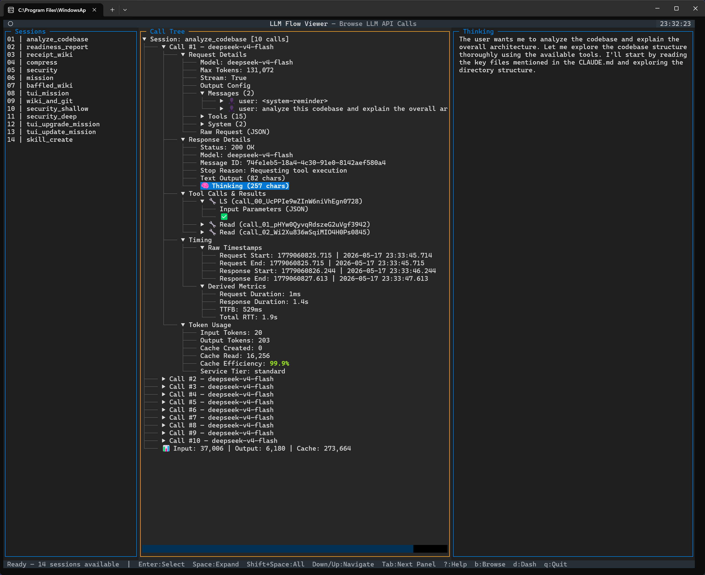
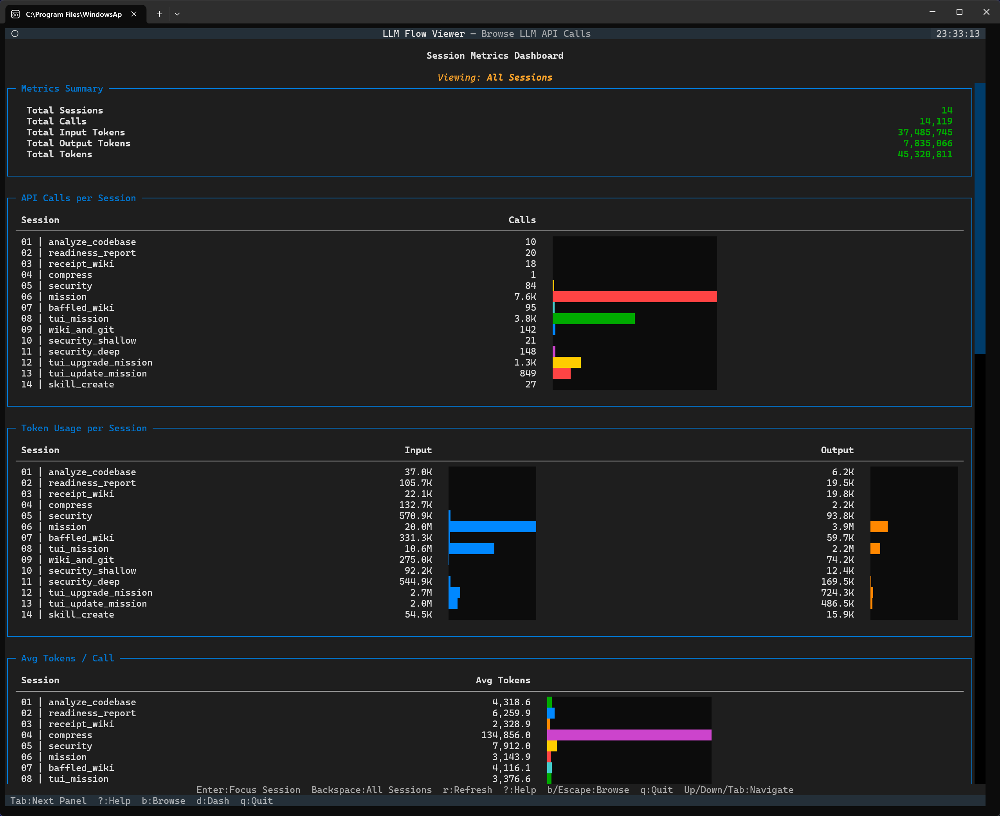

# LLM Flow Viewer

TUI application for browsing and analyzing LLM API call flows captured via [mitmproxy](https://mitmproxy.org/).
Parse raw flow dumps, navigate call trees, inspect requests/responses/tool calls/timing/tokens, and view cross-session analytics dashboards.





## Quickstart

```bash
# Install (Python >= 3.12 required)
pip install -e ".[dev]"

# Launch TUI
llm-flow-viewer --flows-dir /path/to/flow/files

# Or via module
python -m llm_flow_viewer --flows-dir /path/to/flow/files
```

### CLI arguments

| Flag          | Default  | Description                               |
| ------------- | -------- | ----------------------------------------- |
| `--flows-dir` | `flows/` | Directory containing mitmproxy flow files |
| `--session`   | _(none)_ | Jump directly to a session by filename    |

### TUI views

| Key | View                                         |
| --- | -------------------------------------------- |
| `b` | Browse — three-panel session explorer        |
| `d` | Dashboard — cross-session metrics and charts |
| `?` | Help — keyboard shortcuts overlay            |
| `q` | Quit                                         |

## Project layout

```
src/llm_flow_viewer/
├── parser/          Flow reading, JSON/SSE parsing, pairing, Parquet caching
│   ├── reader.py    Open flow files, filter LLM API calls
│   ├── request.py   Parse JSON request bodies
│   ├── response.py  Parse SSE response streams
│   ├── pairing.py   Pair requests+responses, extract timing
│   ├── session.py   Group calls into sessions
│   ├── cache.py     Parquet serialization with schema versioning
│   └── models.py    Dataclass definitions (LLMCall, Session, ...)
└── tui/             Textual TUI application
    ├── app.py       App shell, CLI argument parsing
    ├── screens/
    │   ├── browse.py        Three-panel session explorer
    │   ├── dashboard.py     Cross-session metrics and charts
    │   └── help_screen.py   Modal keyboard shortcut reference
    └── widgets/
        ├── call_tree.py          Collapsible API call tree
        ├── session_list.py       Session discovery sidebar
        ├── detail_panel.py       JSON/text content viewer
        ├── dashboard_widgets.py  Bar charts, metrics, comparisons
        └── app_footer.py         Context-sensitive keyboard hints
tests/
├── parser/         Unit tests for flow parsing and caching
└── tui/            Integration tests for TUI screens and widgets
skills/
└── flow-analysis/  Skill for querying parquet caches and parser layer
```

## Running tests

```bash
# All tests
pytest

# Parser tests only
pytest tests/parser/ -v

# TUI tests only
pytest tests/tui/ -v

# With coverage
pytest --cov=src/llm_flow_viewer --cov-report=term-missing
```

## Flow analysis (programmatic)

Use the flow-analysis skill (`skills/flow-analysis/SKILL.md`) for guidance on querying parquet caches directly:

```python
import pyarrow.parquet as pq

# Read cached responses — no re-parsing needed
resp = pq.read_table("flows/<hash>_<name>_responses.parquet")
req = pq.read_table("flows/<hash>_<name>_requests.parquet")

# Token totals
inp = sum(v for v in resp.column("input_tokens").to_pylist() if v)
out = sum(v for v in resp.column("output_tokens").to_pylist() if v)
print(f"{inp:,} in, {out:,} out")
```

Or use the parser layer directly:

```python
from llm_flow_viewer.parser import flow_file_to_session

session = flow_file_to_session("flows/06_flows-mission", index=6, task_name="mission")
for call in session.calls:
    print(call.request_id, call.response.input_tokens, call.response.output_tokens)
```

## Dependencies

- `textual` — TUI framework
- `mitmproxy` — flow file reading
- `pyarrow` — Parquet cache serialization
- `python-ulid` — request ID generation
- `pytest` + `pytest-asyncio` (dev) — test suite
